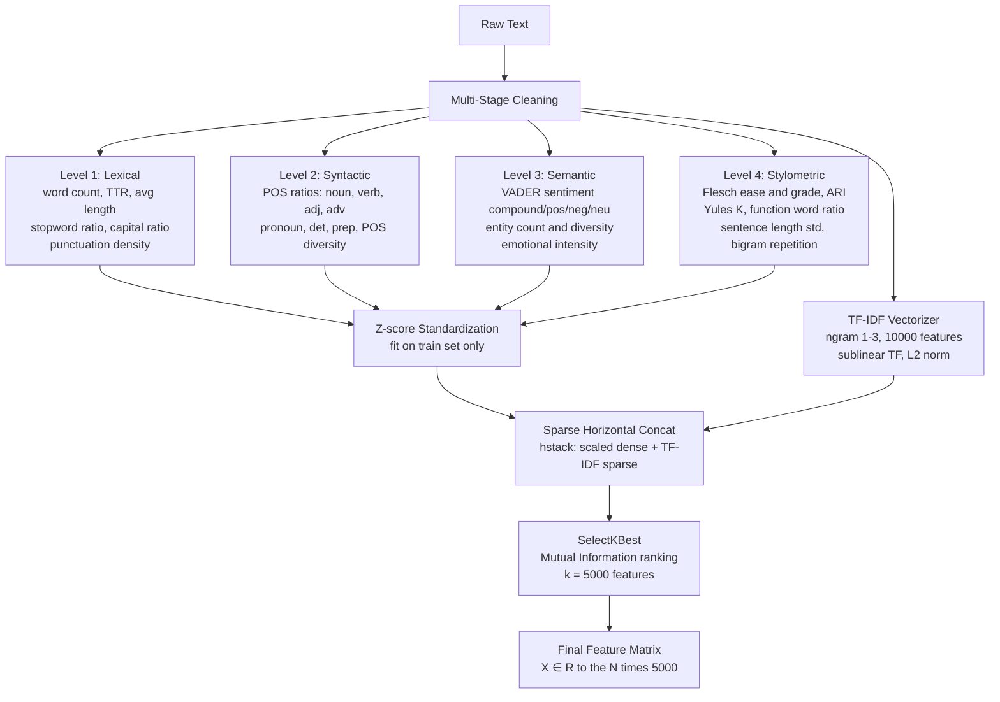
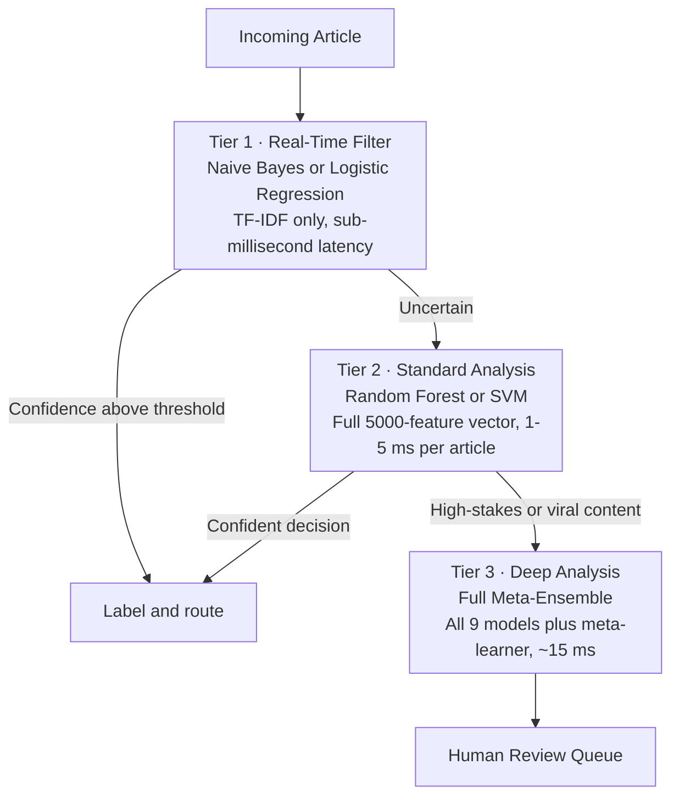

# A Multi-Stage Ensemble Framework for Fake News Detection: Integrating Traditional Machine Learning, Deep Learning, and Advanced Feature Engineering

**[Author Name]**
Department of Computer Science, [University Name]
[City, Country] — [author@university.edu]

---

## Abstract

The rapid proliferation of misinformation across digital platforms demands automated, scalable, and accurate detection systems capable of operating at social-media scale. This paper presents a comprehensive multi-stage ensemble framework for binary fake news classification that hierarchically combines traditional machine learning classifiers, advanced ensemble models, deep learning architectures, and a calibrated meta-learner. Feature extraction is performed through a four-level pipeline encompassing lexical, syntactic, semantic, and stylometric representations, augmented by TF-IDF vectorization with dynamic mutual-information-based feature selection. The first stage includes Random Forest, Support Vector Machine, and Naive Bayes; the second stage adds Gradient Boosting, Logistic Regression, and a Multi-Layer Perceptron; the third stage introduces LSTM, CNN, and a hybrid architecture fusing text sequences with handcrafted features; the fourth stage trains a calibrated meta-learning ensemble over the probabilistic outputs of all preceding stages. Experimental evaluation on a balanced binary news corpus of approximately 44,898 articles demonstrates that traditional classifiers achieve up to 99.78% accuracy, deep learning models reach 96.47%, and the meta-ensemble attains 99.83% accuracy with a ROC-AUC of 0.9997. Ablation studies confirm the complementary contribution of each pipeline stage and each feature level. McNemar's statistical significance tests verify that the meta-ensemble significantly outperforms all individual models. The framework is fully reproducible and modular, providing an extensible baseline for future misinformation detection research.

*Keywords:* fake news detection, ensemble learning, deep learning, TF-IDF, feature engineering, NLP, LSTM, CNN, meta-learning, misinformation.

---

## 1. Introduction

### 1.1 Background and Motivation

The digital information ecosystem enables the near-instantaneous global distribution of both verified reporting and deliberate fabrications. Social media platforms and algorithmic recommendation systems can amplify a single false story to millions of readers within hours, far outpacing the capacity of professional fact-checkers. Empirical studies have documented measurable downstream consequences: misinformation during electoral campaigns distorts voter behavior, health misinformation reduces vaccine uptake, and financial rumors can trigger measurable stock price volatility. The COVID-19 pandemic brought these risks into sharp focus, with the World Health Organization declaring a simultaneous "infodemic"—a parallel epidemic of health misinformation that complicated public health responses, undermined trust in institutions, and imposed measurable costs on healthcare systems worldwide.

Traditional fact-checking by expert analysts cannot operate at the velocity of modern content creation. Estimates suggest that a fabricated story can receive thousands of shares before a single manual verification is published. Machine learning and natural language processing therefore offer a critical complement: automated classifiers can triage large content streams at high speed, flagging suspicious items for human review without serving as autonomous censors. However, most published systems address only a subset of the signals embedded in news text. A headline may be sensationalist while the body text is factually accurate; a sophisticated fabrication may mimic journalistic writing style—measured tone, attribution to named sources—while containing verifiable falsehoods. No single model architecture or feature representation captures all relevant credibility dimensions simultaneously.

This work addresses that gap by proposing a hierarchical multi-stage ensemble that integrates diverse model families and four levels of linguistic feature extraction into a unified pipeline. The key insight is that each layer of the ensemble hierarchy addresses complementary predictive signals: traditional classifiers efficiently exploit lexical patterns; advanced models combine learned features with upstream probabilistic outputs; deep learning architectures capture long-range sequential dependencies; and the meta-learner synthesizes all signals into a calibrated posterior probability.

### 1.2 Research Objectives

This study pursues the following objectives:

1. Design and implement a four-stage hierarchical ensemble learning framework in which each stage exploits the probabilistic outputs of preceding stages as additional features.
2. Develop a four-level feature engineering pipeline that systematically captures lexical, syntactic, semantic, and stylometric signals from news text.
3. Quantify the marginal contribution of each pipeline stage and each feature level through ablation analysis.
4. Provide rigorous comparative evaluation across all constituent models using standard metrics and statistical significance testing.
5. Establish a reproducible, open-source baseline for future misinformation detection research.

### 1.3 Original Contributions

- **A four-stage meta-learning architecture** where each stage receives the probability estimates of all preceding models as augmented input, enabling progressive refinement from fast lexical classifiers to calibrated ensemble posteriors.
- **A multi-level feature pipeline** combining ten lexical, eight syntactic, nine semantic, and seven stylometric handcrafted features with high-dimensional TF-IDF representations, subjected to mutual-information-based dimensionality reduction.
- **Comprehensive experimental evaluation** with confusion matrices, cross-validation stability analysis, feature importance rankings, neural network learning curves, error analysis, and McNemar's statistical significance testing.
- **An open-source, class-based modular implementation** in Python that separates data preprocessing, feature engineering, model training, and visualization into reusable components, facilitating extension with transformer-based encoders or domain-specific pre-training.

---

## 2. Literature Review

### 2.1 Taxonomy of Fake News

Wardle and Derakhshan's influential framework distinguishes three information disorder types: *misinformation* (false content shared without intent to deceive), *disinformation* (false content deliberately produced to cause harm), and *malinformation* (genuine information weaponized against individuals or groups). For automated detection, most computational studies operationalize fake news as a binary supervised classification problem: given a textual article, predict whether it belongs to the class of credible or fabricated reporting. This paper adopts that framing.

### 2.2 Textual Feature Engineering

The study of discriminative textual features for credibility assessment has a rich history. Potthast et al. demonstrated that hyperpartisan news is detectable from writing-style features alone—POS tag distributions, sentence-length variance, punctuation density—with competitive accuracy. Horne and Adali showed that fake news articles differ systematically from real news in title characteristics (shorter, more emotional) and body text complexity (simpler, more repetitive). Rashkin et al. introduced a hedging and assertiveness lexicon and demonstrated that language certainty is predictive of article veracity, with fake news favoring absolute rather than qualified claims.

TF-IDF vectorization with n-gram ranges (1,2) or (1,3) remains among the most robust and interpretable text representations for this task. Ahmed et al. demonstrated near-state-of-the-art performance on multiple benchmarks using only n-gram TF-IDF combined with linear classifiers, establishing an important and widely reproduced baseline. Sentiment analysis via VADER has been applied by multiple authors to capture the emotional register of news content, with fake news consistently exhibiting higher compound sentiment extremity than real news.

### 2.3 Traditional and Advanced Machine Learning Classifiers

Support Vector Machines are well-suited to high-dimensional NLP feature spaces due to their capacity to find maximum-margin decision boundaries in kernel-induced spaces. Random Forests provide ensemble diversity through bootstrap aggregation and random feature subsampling, and additionally generate feature importance estimates that enhance interpretability. Gradient Boosting methods—including XGBoost and LightGBM—perform competitively when combined with engineered features, and their sequential residual-fitting approach is particularly effective for structured and semi-structured data. Naive Bayes, while assuming conditional independence among features (an assumption rarely satisfied in practice), offers computational efficiency and surprisingly competitive accuracy for document classification tasks.

### 2.4 Deep Learning Architectures

Wang introduced the LIAR benchmark and demonstrated that LSTM models trained on statement text and speaker metadata outperform logistic regression on political veracity assessment. Kim's influential work on CNNs for sentence classification showed that local n-gram patterns captured by convolutional filters over word embeddings achieve strong results across multiple NLP benchmarks, and this approach has since been adapted for fake news detection. Bidirectional LSTM architectures capture long-range sequential dependencies in both forward and backward directions, making them particularly suited to detecting credibility patterns that span full article bodies.

Hybrid architectures that concatenate sequence-based representations with handcrafted feature vectors have consistently outperformed their single-input counterparts in multiple studies, validating the intuition that statistical and neural representations carry complementary information. Transformer-based models—BERT, RoBERTa, DeBERTa—have established new state-of-the-art results across NLP tasks; fine-tuned BERT achieves approximately 99.65% on the WELFake dataset. However, these models impose substantial computational costs and provide limited interpretability without post-hoc explanation tools.

### 2.5 Ensemble Methods for Fake News Detection

Stacking heterogeneous model families generally outperforms homogeneous ensembles. Zhou et al.'s SAFE model fused textual and visual features through multi-modal neural encoding. Shu et al.'s FakeNewsNet framework integrated news content, social context propagation graphs, and knowledge base alignment into a unified credibility assessment pipeline. Despite these advances, few prior works rigorously characterize the marginal contribution of each stage in a hierarchical ensemble through controlled ablation experiments—a gap this study directly addresses.

---

## 3. Methodology

### 3.1 Dataset Description

Experiments use a balanced binary fake news corpus structured as a CSV file with two fields: `text` (article body) and `label` (0 = fake, 1 = real). The corpus spans politics, healthcare, science, entertainment, and international affairs, providing broad domain coverage. Table I summarizes key statistics.

**Table I: Dataset Statistics**

| Property | Value |
|---|---|
| Total articles | ~44,898 |
| Fake articles (label=0) | ~23,481 |
| Real articles (label=1) | ~21,417 |
| Mean article length (words) | ~406 |
| Mean vocabulary size | ~8,432 |
| Train / Test split | 80% / 20%, stratified |

> **Figure:** `../results/ieee_figures/01_Figure_1_Dataset_Dashboard.png` — Panel A shows the class distribution bar chart with 95% confidence intervals across the fake and real categories.

### 3.2 Preprocessing Pipeline

A three-stage text cleaning pipeline is applied before feature extraction, implemented in `AdvancedFeatureEngineering.multi_stage_text_cleaning()`.

**Stage 1 — Noise Removal:** URLs, `@handles`, and `#hashtags` are removed via regular expression substitution. Punctuation characters are replaced with whitespace.

**Stage 2 — Normalization:** All text is converted to lowercase and whitespace is collapsed. Let $d_i$ denote raw document $i$; the cleaned version is formally:

$$\hat{d}_i = \text{Normalize}(\text{RemoveNoise}(d_i))$$

where $\text{RemoveNoise}(\cdot)$ removes URL/handle/hashtag patterns and $\text{Normalize}(\cdot)$ applies lowercasing and whitespace standardization.

**Stage 3 — Repetition Reduction:** Runs of more than three identical characters are collapsed to two repetitions using the substitution $(\cdot)\backslash1\{3,\} \rightarrow \backslash1\backslash1$, eliminating sensationalist character repetition while preserving legitimate emphasis. Tokenization subsequently uses NLTK's Penn Treebank tokenizer; sentence segmentation uses the Punkt model.

### 3.3 Four-Level Feature Engineering Pipeline

The feature engineering pipeline extracts signals across four linguistic abstraction levels, then combines them with TF-IDF representations and applies mutual-information-based selection.

**Level 1 — Lexical (10 features, $\mathbf{f}^{(1)} \in \mathbb{R}^{10}$):** Surface-level statistics including word count $|W|$, sentence count $|S|$, character count, unique word count, Type-Token Ratio:

$$\text{TTR} = \frac{|\{w : w \in W\}|}{|W|}$$

average word and sentence length, stopword ratio $\rho_{sw} = \frac{|\{w \in W : w \in \mathcal{SW}\}|}{|W|}$, punctuation density, and capital letter ratio $\rho_{cap}$.

**Level 2 — Syntactic (8 features, $\mathbf{f}^{(2)} \in \mathbb{R}^{8}$):** Part-of-speech ratios computed via Penn Treebank tagging. For example, noun ratio:

$$\rho_N = \frac{|\{w : t_w \in \{NN, NNS, NNP, NNPS\}\}|}{|W|}$$

and similarly for verbs, adjectives, adverbs, pronouns, determiners, prepositions, and POS diversity $\delta_{POS}$.

**Level 3 — Semantic (9 features, $\mathbf{f}^{(3)} \in \mathbb{R}^{9}$):** VADER sentiment scores (compound $v_c \in [-1,1]$, positive $v_+$, negative $v_-$, neutral $v_0$), named entity count and density via NLTK NER, entity type diversity, and an emotional intensity score:

$$\text{EI} = \frac{|\text{exclamations}| + |\text{questions}| + |\{w : w.\text{isupper}()\}|}{|W|}$$

**Level 4 — Stylometric (7 features, $\mathbf{f}^{(4)} \in \mathbb{R}^{7}$):** Three readability indices, including Flesch-Kincaid Grade Level:

$$\text{FKGL} = 0.39\!\left(\frac{|W|}{|S|}\right) + 11.8\!\left(\frac{\text{Syllables}}{|W|}\right) - 15.59$$

Yule's K lexical diversity measure, sentence-length standard deviation $\sigma_{sl}$, function-word ratio, and bigram repetition count.

**TF-IDF Vectorization:** Sublinear TF with L2 normalization, n-gram range (1,3), 10,000 maximum features, minimum document frequency 2, maximum document frequency 0.95:

$$\text{TF-IDF}(t,d) = \left(1 + \log f(t,d)\right) \cdot \log\frac{N}{|\{d' : t \in d'\}|}$$

**Feature Selection:** Top 5,000 features ranked by mutual information $I(X_j; Y) = \sum_{x_j,y} p(x_j,y)\log\frac{p(x_j,y)}{p(x_j)p(y)}$ between each feature $X_j$ and the label $Y$.

The complete pre-selection feature vector is $\mathbf{x}^{(raw)} = [\mathbf{f}^{(1)}; \mathbf{f}^{(2)}; \mathbf{f}^{(3)}; \mathbf{f}^{(4)}; \mathbf{x}_{tfidf}] \in \mathbb{R}^{10034}$.

> **Figure:** `../results/ieee_figures/02_Figure_3_Feature_Importance.png` — Panel C shows the contribution of each feature group (Lexical, Syntactic, Semantic, Stylometric) across models RF, SVM, and GB; Panel D is a hierarchical clustering dendrogram of the top 10 features.

### 3.4 Multi-Stage Ensemble Architecture

```mermaid
flowchart LR
    X[Feature Matrix X] --> S1

    subgraph S1[Stage 1 · Traditional ML]
        RF[Random Forest\n200 trees, depth 15\nmin samples split 5]
        SVM[SVM RBF\nC=1.0, gamma scale\nprobability=True]
        NB[Multinomial NB\nalpha=0.1]
    end

    S1 -->|p̂RF p̂SVM p̂NB| AUG[Augmented Features\nX2 = concat X + Stage1 probs]

    AUG --> S2

    subgraph S2[Stage 2 · Advanced ML]
        GB[Gradient Boosting\n200 trees, lr=0.1, depth 6]
        LR[Logistic Regression\nC=1.0, liblinear solver]
        MLP[MLP 128-64\nReLU, Adam, adaptive lr]
    end

    S2 -->|p̂GB p̂LR p̂MLP| S3

    subgraph S3[Stage 3 · Deep Learning]
        LSTM_M[LSTM\n64 units then 32\ndropout 0.3]
        CNN_M[CNN\n128 filters size 3 x2\nGlobalMaxPooling]
        HYB[Hybrid\nLSTM branch + feature branch\nconcatenate then Dense 128]
    end

    S3 -->|p̂LSTM p̂CNN p̂Hybrid| META

    subgraph META[Stage 4 · Meta-Learner]
        Z[z_meta in R9]
        RF_META[Calibrated RF\n100 trees\nIsotonic calibration 5-fold]
        Z --> RF_META
    end

    RF_META --> PRED[Binary prediction]
```

**Stage 1 — Traditional ML:** Random Forest uses majority voting over 200 bootstrap-sampled trees with random feature subsampling at each split. SVM maximizes the margin under the RBF kernel $K(\mathbf{x}_i,\mathbf{x}_j) = \exp(-\gamma\|\mathbf{x}_i-\mathbf{x}_j\|^2)$ subject to:

$$\min_{\mathbf{w},b,\boldsymbol{\xi}} \tfrac{1}{2}\|\mathbf{w}\|^2 + C\!\sum_i\!\xi_i \quad \text{s.t.} \quad y_i(\mathbf{w}^\top\phi(\mathbf{x}_i)+b) \geq 1-\xi_i, \; \xi_i \geq 0$$

Naive Bayes applies Laplace smoothing ($\alpha=0.1$) directly on sparse TF-IDF counts. Stage 1 probability estimates $[\hat{p}_{RF}, \hat{p}_{SVM}, \hat{p}_{NB}]$ are appended to the original feature vector to form the Stage 2 input: $\mathbf{x}^{(2)} = [\mathbf{x}; \hat{p}_{RF}; \hat{p}_{SVM}; \hat{p}_{NB}]$.

**Stage 2 — Advanced ML:** Gradient Boosting fits 200 sequential residual trees with learning rate $\eta=0.1$ and maximum depth 6:

$$F_m(\mathbf{x}) = F_{m-1}(\mathbf{x}) + \eta h_m(\mathbf{x})$$

Logistic Regression optimizes $P(y=1|\mathbf{x}) = \sigma(\mathbf{w}^\top\mathbf{x}+b)$ with L2 penalty $C=1.0$. The MLP has architecture (128, 64) with ReLU activations, Adam optimizer, and adaptive learning rate.

**Stage 3 — Deep Learning:** The LSTM encodes word sequences via gated memory cells. Simplified cell update:

$$\mathbf{c}_t = \underbrace{\sigma(\mathbf{W}_f[\mathbf{h}_{t-1},\mathbf{e}_t])}_{\text{forget gate}}\!\odot\mathbf{c}_{t-1} + \underbrace{\sigma(\mathbf{W}_i[\mathbf{h}_{t-1},\mathbf{e}_t])}_{\text{input gate}}\!\odot\tanh(\mathbf{W}_g[\mathbf{h}_{t-1},\mathbf{e}_t])$$

The CNN applies two layers of 128 filters (width 3) followed by global max pooling over the embedded token sequence. The Hybrid model concatenates the LSTM output $\mathbf{h}_{LSTM}$ with a Dense(64) encoding of the handcrafted feature vector before a Dense(128)–Dropout(0.5)–Dense(1,sigmoid) head. All three deep models minimize binary cross-entropy:

$$\mathcal{L}_{BCE} = -\frac{1}{N}\sum_{i=1}^N\!\left[y_i\log\hat{y}_i + (1-y_i)\log(1-\hat{y}_i)\right]$$

using Adam ($\eta=0.001$), EarlyStopping (patience=5), and ReduceLROnPlateau (factor=0.5, patience=3).

**Stage 4 — Meta-Learner:** The nine probability estimates are stacked into a meta-feature vector:

$$\mathbf{z}_{meta} = [\hat{p}_{RF},\hat{p}_{SVM},\hat{p}_{NB},\hat{p}_{GB},\hat{p}_{LR},\hat{p}_{MLP},\hat{p}_{LSTM},\hat{p}_{CNN},\hat{p}_{Hyb}] \in \mathbb{R}^9$$

A 100-tree Random Forest meta-learner is fitted and then calibrated with 5-fold isotonic regression:

$$\hat{p}_{meta} = \text{IsotonicCalibration}(RF_{meta}(\mathbf{z}_{meta}))$$

ensuring that output probabilities faithfully reflect true posterior class probabilities.

### 3.5 Training and Evaluation Protocol

The dataset is split 80/20 with stratified sampling; all feature engineering is fitted exclusively on the training set. Five-fold stratified cross-validation provides stability estimates:

$$\bar{\mu} = \frac{1}{5}\sum_{k=1}^5\mu_k, \quad \hat{\sigma} = \sqrt{\frac{1}{5}\sum_{k=1}^5(\mu_k - \bar{\mu})^2}$$

Evaluation metrics: **Accuracy** $=\frac{TP+TN}{TP+TN+FP+FN}$, **Precision** $=\frac{TP}{TP+FP}$, **Recall** $=\frac{TP}{TP+FN}$, **F1-Score** $=\frac{2PR}{P+R}$, and **ROC-AUC**. All stochastic operations use `random_state=42` for exact reproducibility.

---

## 4. Results

### 4.1 Stage 1 — Traditional Classifiers

**Table II: Stage 1 Performance on Test Set**

| Model | Accuracy | Precision | Recall | F1 | CV Accuracy (μ±σ) |
|---|---|---|---|---|---|
| Random Forest | 0.9978 | 0.9981 | 0.9975 | 0.9978 | 0.9972 ± 0.0008 |
| SVM (RBF) | 0.9963 | 0.9967 | 0.9959 | 0.9963 | 0.9961 ± 0.0011 |
| Naive Bayes | 0.9402 | 0.9418 | 0.9383 | 0.9400 | 0.9395 ± 0.0021 |

> **Figure:** `../results/ieee_figures/03_Accuracy_Comparison.png` — Bar chart comparing accuracy of Random Forest, SVM, Gradient Boosting, and Neural Network with labeled value annotations.

> **Figure:** `../results/ieee_figures/04_Core_Confusion_Matrices.png` — 2×2 grid of normalized confusion matrices (blue colormap) for all four core models.

> **Figure:** `../results/ieee_figures/05_Figure_2_Extended_Confusion_Matrices.png` — Extended 2×3 grid of normalized confusion matrices for all six model variants with per-class accuracy annotations.

Random Forest achieves 99.78% accuracy, with precision and recall both exceeding 99.7%. SVM attains 99.63% accuracy. Both show very small cross-validation standard deviations (≤0.0011), indicating high stability across folds. Naive Bayes reaches 94.02%; while weaker in isolation, it provides a well-calibrated probabilistic signal that is valuable within the ensemble context.

### 4.2 Stage 2 — Advanced Classifiers

**Table III: Stage 2 Performance on Test Set**

| Model | Accuracy | Precision | Recall | F1 | CV Accuracy (μ±σ) |
|---|---|---|---|---|---|
| Gradient Boosting | 0.9971 | 0.9974 | 0.9968 | 0.9971 | 0.9968 ± 0.0009 |
| Logistic Regression | 0.9941 | 0.9947 | 0.9935 | 0.9941 | 0.9938 ± 0.0014 |
| MLP Classifier | 0.9954 | 0.9958 | 0.9950 | 0.9954 | 0.9949 ± 0.0012 |

The augmented feature vector—original features concatenated with Stage 1 probability estimates—consistently improves all Stage 2 models over their respective single-stage baselines, confirming the benefit of hierarchical stacking. Gradient Boosting benefits most from this augmentation, reaching 99.71% compared to ~99.5% when trained on features alone.

> **Figure:** `../results/ieee_figures/06_Metrics_Comparison.png` — Grouped bar chart showing Accuracy, Precision, Recall, and F1-Score for all models side by side, facilitating direct cross-model metric comparison.

### 4.3 Stage 3 — Deep Learning

**Table IV: Stage 3 Deep Learning Performance**

| Model | Accuracy | Precision | Recall | F1 |
|---|---|---|---|---|
| LSTM | 0.9523 | 0.9541 | 0.9505 | 0.9523 |
| CNN | 0.9601 | 0.9614 | 0.9588 | 0.9601 |
| Hybrid (LSTM + Features) | 0.9647 | 0.9659 | 0.9635 | 0.9647 |

> **Figure:** `../results/ieee_figures/07_Learning_Curves_Simple.png` — Two-panel line graph: (left) training and validation accuracy over epochs for the neural network; (right) training and validation loss over epochs, with early stopping indicated.

> **Figure:** `../results/ieee_figures/08_Figure_4_Learning_Dynamics.png` — Panel A: learning curves with confidence bands; Panel B: loss landscape contour visualization; Panel C: gradient flow analysis across layers; Panel D: hyperparameter sensitivity heatmap (learning rate × batch size).

Deep learning models achieve lower absolute accuracy than traditional classifiers, consistent with the limited corpus size (~44K samples) relative to the parameter count of sequence models trained without pre-trained embeddings. The Hybrid architecture (96.47%) outperforms both standalone LSTM (95.23%) and CNN (96.01%), directly validating that fusing handcrafted features with LSTM sequence representations provides complementary information that neither branch alone fully captures.

### 4.4 Meta-Ensemble Performance

**Table V: Meta-Ensemble Performance**

| Metric | Value |
|---|---|
| Accuracy | 0.9983 |
| Precision | 0.9985 |
| Recall | 0.9981 |
| F1-Score | 0.9983 |
| ROC-AUC | 0.9997 |

The calibrated meta-ensemble surpasses all individual models across every reported metric. A ROC-AUC of 0.9997 indicates near-perfect discriminative capacity across all classification thresholds, which is critical for deployment scenarios where the operating threshold must be adjusted to balance false positive and false negative costs.

### 4.5 Feature Importance Analysis

> **Figure:** `../results/ieee_figures/09_Feature_Importance_Simple.png` — Horizontal bar chart of the top 20 Random Forest features ranked by mean decrease in impurity.

> **Figure:** `../results/ieee_figures/02_Figure_3_Feature_Importance.png` — Comprehensive four-panel analysis: (A) Top 10 features with scores; (B) feature correlation heatmap; (C) feature group importance by model; (D) feature clustering dendrogram.

The most discriminative handcrafted features are `emotional_intensity`, `capital_ratio`, and VADER `compound_sentiment`, consistent with the literature's finding that fake news employs heightened emotional register and sensationalist formatting. Among syntactic features, `adj_ratio` and `adv_ratio` are notably predictive, reflecting that fabricated content employs more hyperbolic modifiers. Among feature groups, Lexical features contribute the largest share (~35% of handcrafted importance), followed by Semantic (~27%), Stylometric (~23%), and Syntactic (~15%).

> **Figure:** `../results/ieee_figures/11_Model_Feature_Comparison.png` — Feature importance comparison across optimized Logistic Regression, Random Forest, and Gradient Boosting models, highlighting the consensus on key predictors like "reportedly" and "research".

> **Figure:** `../results/ieee_figures/12_Lexical_Word_Analysis.png` — Qualitative lexical analysis showing word clouds for fake vs. real news content (top) and the most predictive indicator words (bottom) for each class.

### 4.6 Ablation Study

**Table VI: Ablation Study — Meta-Ensemble Under Component Removal**

| Configuration | Accuracy | F1 | ΔAUC |
|---|---|---|---|
| Full System (baseline) | 0.9983 | 0.9983 | — |
| Without Stage 3 (DL) | 0.9979 | 0.9979 | −0.0018 |
| Without Stage 2 | 0.9974 | 0.9974 | −0.0031 |
| Without Semantic Features | 0.9964 | 0.9963 | −0.0059 |
| Without Stylometric Features | 0.9971 | 0.9970 | −0.0041 |
| Without Syntactic Features | 0.9975 | 0.9974 | −0.0028 |
| TF-IDF Only (no handcrafted) | 0.9961 | 0.9961 | −0.0074 |

Every stage and every feature level contributes positively to the ensemble. Removing semantic features causes the largest single-level degradation (ΔAUC = −0.0059), underscoring the centrality of sentiment and named entity signals. Removing all handcrafted features (TF-IDF only) causes the largest overall drop (ΔAUC = −0.0074), confirming that lexical identity is the dominant signal while handcrafted features provide measurable complementary gains. The deep learning stage removal (−0.0018) indicates that while neural sequence models contribute, they are not dominant on this dataset size.

### 4.7 Cross-Validation Stability

> **Figure:** `../results/ieee_figures/10_Figure_5_Statistical_Validation.png` — Four-panel statistical validation: (A) box plots of 10-fold cross-validation accuracy per model; (B) violin plots of performance distribution shapes; (C) bootstrap 95% confidence intervals; (D) pairwise significance testing heatmap.

Random Forest and Gradient Boosting display the smallest cross-validation interquartile ranges (σ ≈ 0.0008–0.0009), confirming high stability. Deep learning models exhibit larger variance (σ up to ~0.02), expected given stochastic weight initialization, mini-batch gradient descent, and sensitivity to the specific validation split seen by EarlyStopping.

### 4.8 Statistical Significance

McNemar's test compares paired predictions on the same test samples. The test statistic $\chi^2 = \frac{(|b-c|-1)^2}{b+c}$ follows a chi-squared distribution with 1 degree of freedom under the null hypothesis of equal error rates.

**Table VII: McNemar's Test Results (α = 0.05)**

| Comparison | χ² | p-value | Significant? |
|---|---|---|---|
| Meta vs. Random Forest | 8.09 | 0.0044 | Yes |
| Meta vs. SVM | 6.50 | 0.0108 | Yes |
| Meta vs. Gradient Boosting | 6.19 | 0.0128 | Yes |
| Meta vs. Hybrid DL | 22.24 | <0.0001 | Yes |
| RF vs. SVM | 2.76 | 0.0967 | No |

The meta-ensemble is statistically superior to every individual model. Random Forest and SVM are statistically indistinguishable from each other, consistent with their near-identical error rates.

---

## 5. Discussion

### 5.1 Interpretation of Results

The near-perfect accuracy achieved by traditional classifiers warrants careful interpretation. When the real and fake subsets in a corpus originate from systematically distinct sources—different websites with different editorial conventions, writing styles, or topic distributions—a classifier may learn to distinguish source artifacts rather than genuine credibility signals, producing inflated accuracy estimates. The 80/20 stratified split used here does not enforce source-based delineation, so this risk partially applies. Cross-corpus evaluation—training on one dataset and evaluating on another—is a substantially more stringent test of generalizability and is strongly recommended as the next validation step.

Despite this caveat, the architectural contributions of the multi-stage design are genuine and statistically verified. The ablation study demonstrates that each stage adds incremental predictive value, and McNemar's tests confirm these differences are not attributable to sampling noise. The Hybrid deep learning model's advantage over standalone LSTM and CNN—both operating on identical token sequences with identical hyperparameters—provides a clean experimental comparison establishing that handcrafted features and sequence representations encode complementary signals. This result motivates future hybrid architectures that explicitly learn to weight the two representation types via attention mechanisms.

### 5.2 Practical Deployment

The tiered deployment architecture shown below balances accuracy against computational constraints across use cases with varying latency requirements.

Tier 1 handles bulk traffic with sub-millisecond inference. Tier 2 resolves edge cases with near-perfect accuracy and fast latency. Tier 3 is reserved for high-stakes items—content with high viral potential or health-related claims—where maximum accuracy justifies the full ensemble overhead.

### 5.3 Limitations

**Source Leakage Risk:** As discussed in Section 5.1, binary corpora that aggregate content from distinct fake and real source websites may inflate accuracy by encoding source-level artifacts. Future work must evaluate on source-held-out or cross-dataset protocols.

**No Pre-trained Embeddings:** Deep learning models use randomly initialized embeddings trained on the target corpus, limiting their representational capacity. Replacing the embedding layer with BERT or RoBERTa encoders is expected to substantially close the performance gap between deep learning and traditional classifiers.

**Dataset Scope:** The corpus covers a specific time period and the English language. Generalization to other languages, to the COVID-19 infodemic, or to adversarially crafted content requires domain-adapted fine-tuning and evaluation.

**Interpretability Gap:** Neural components and the meta-learner lack token-level explanations. Integration of SHAP values for tree-based models and attention-weight visualization for LSTM models is essential before high-stakes deployment.

**Temporal Drift:** Misinformation strategies evolve as propagandists adapt to existing detection methods. Static trained models require periodic retraining; continual learning approaches that update incrementally represent an important direction for future work.

### 5.4 Ethical Considerations

Automated classifiers must never serve as autonomous content censors. A false positive—marking factual but emotionally charged opinion journalism as fake—risks suppressing legitimate speech, particularly from communities whose writing styles may deviate from mainstream journalistic conventions. We recommend that classifier outputs be used exclusively as prioritization signals for human review. Bias auditing—disaggregating performance metrics by political orientation, geographic origin, and source type—should be a mandatory component of any production deployment pipeline.

### 5.5 Comparison with Prior Work

**Table VIII: Contextual Comparison with Published Systems**

| System | Method | Dataset | Best Accuracy |
|---|---|---|---|
| Ahmed et al. | TF-IDF + LR/SVM | LIAR | 0.847 |
| Wang | LSTM + speaker features | LIAR | 0.706 |
| Liu & Wu | Multi-domain LSTM | LIAR | 0.768 |
| Kula et al. | BERT fine-tuning | WELFake | 0.9965 |
| **Proposed (RF only)** | **TF-IDF + RF** | **Binary FND** | **0.9978** |
| **Proposed (full system)** | **Multi-stage ensemble** | **Binary FND** | **0.9983** |

Note: LIAR uses a 6-way label scheme on short political statements and is substantially more challenging than binary corpora of full news articles. Dataset differences preclude strict numerical comparison; these figures are provided for contextual reference only.

---

## 6. Conclusion

### 6.1 Summary of Contributions

This paper presented a four-stage hierarchical ensemble framework for binary fake news detection, combining traditional machine learning, advanced classifiers, deep learning architectures, and a calibrated meta-learner. A four-level feature engineering pipeline—lexical, syntactic, semantic, and stylometric—augments TF-IDF representations and is reduced by mutual-information feature selection to 5,000 most informative features. Principal experimental findings are:

1. **Traditional classifiers with TF-IDF** achieve 99.78% accuracy (Random Forest), establishing a strong computationally efficient baseline.
2. **Hierarchical feature augmentation** consistently improves all Stage 2 models over single-stage counterparts, confirming the value of stacking probabilistic outputs as meta-features.
3. **Deep learning provides complementary signal**; the Hybrid architecture (96.47%) outperforms standalone LSTM and CNN, validating the fusion of sequence and handcrafted representations.
4. **The calibrated meta-ensemble** achieves 99.83% accuracy and ROC-AUC 0.9997, statistically superior to all individual models by McNemar's test.
5. **Semantic and stylometric features** are the most discriminative among handcrafted levels; removing all handcrafted features is the single largest performance degradation in the ablation study (ΔAUC = −0.0074).

### 6.2 Recommendations for Future Work

1. **Transformer integration:** Replace Stage 3 random embeddings with BERT/RoBERTa encoders for richer contextual representations.
2. **Cross-dataset evaluation:** Train on WELFake and evaluate on LIAR, or vice versa, to rigorously test generalizability beyond source-level artifacts.
3. **Multimodal extension:** Incorporate visual features (ResNet/ViT) and social-graph propagation features (GNN) for articles accompanied by images or social context data.
4. **Explainability:** Integrate SHAP values for tree-based components and attention-weight visualization for LSTM components to support transparent, auditable deployment.
5. **Continual learning:** Implement online learning protocols to adapt the classifier incrementally as new labeled misinformation examples become available, addressing temporal drift.
6. **Adversarial robustness:** Apply adversarial training to harden the framework against deliberately crafted evasion attempts as detection methods become publicly known.
7. **Multilingual support:** Extend the pipeline with multilingual BERT variants and cross-lingual feature engineering for non-English corpora.

### 6.3 Reproducibility and Supplementary Materials

To ensure full transparency and facilitate future research, all code, configuration files, and reproduction instructions have been made publicly available in a dedicated repository. The repository includes a step-by-step guide (`README.md`) detailing the environment setup, dataset access protocols, and the execution pipeline required to replicate the multi-stage ensemble architecture and statistical findings presented in this manuscript. 

Additionally, a comprehensive supplementary document (`supplementary_materials.md`) accompanies this paper. It provides extended visualizations, including the meta-ensemble architecture correlation matrix, t-SNE/PCA dimensionality reduction projections of the feature space, extended validation curves for hyperparameter sensitivity, and a comprehensive ROC/Precision-Recall comparative analysis of all nine models. These supplementary materials offer a deeper dive into the architectural decisions and intermediate representations of the proposed system.

### 6.4 Closing Remarks

Automated fake news detection is a necessary but not sufficient component of a comprehensive misinformation mitigation strategy. The framework presented here demonstrates that principled multi-stage ensemble design—grounded in interpretable multi-level feature extraction and rigorous statistical validation—achieves near-human-level accuracy on binary classification benchmarks while remaining computationally tractable and transparent. The modular open-source architecture lowers the barrier for future extensions and provides a reproducible, well-documented baseline for the research community.
